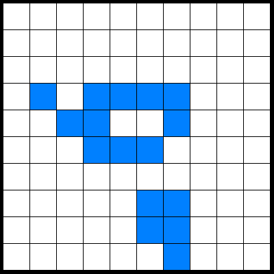

# fpga-game-of-life
Game of life written in HDL using SystemVerilog.

See the [project report](project-report.pdf).

## Required utilities
- Python (optional)
- SystemVerilog/ModelSim
- Windows

## How to use
`run.bat (grid_size) (test_generations)` where grid_size is the number of rows/columns on the grid and test_generations is the number of generations to simluate. If asked to edit the 'setup.txt' file, modify and save the file before continuing.
* Running `build.bat (grid_size)` will generate the necessary utility files without running a simulation.
* If you do not have Python you can run the current test setup using `vsim -do run.do -c` but you will not be able to change the grid size or number of test generations.
* The Python extension Pillow is required for automatic image conversion to .png, although it will still output images to .tga format without Pillow.
Use `py -m pip install --upgrade Pillow` to install Pillow before running the first simulation.

## Sample renders
The following renders and outputs were generated with the current setup in `setup.txt` using `run.bat 10 10`

<br>
Generation 1

<br>
Generation 2

<br>
Generation 3

... `/renders/gen*.png`

## Sample output
```
# 0  0  0  0  0  0  0  0  0  0
# 0  0  0  0  0  0  0  0  0  0
# 0  1  0  0  0  0  0  0  0  0
# 0  1  0  0  1  1  0  0  0  0  
# 0  0  1  1  0  1  1  0  0  0
# 0  0  0  0  1  0  0  0  0  0
# 0  0  0  0  0  0  0  0  0  0
# 0  1  0  0  0  1  0  0  0  0
# 0  1  0  0  0  1  1  0  0  0
# 0  0  0  0  0  0  0  1  0  0
# ---------------------------------------------------------
# Paused: false;        Generation:           1;
# ---------------------------------------------------------
# 0  0  0  0  0  0  0  0  0  0
# 0  0  0  0  0  0  0  0  0  0
# 0  0  0  0  0  0  0  0  0  0
# 0  1  0  1  1  1  1  0  0  0
# 0  0  1  1  0  0  1  0  0  0
# 0  0  0  1  1  1  0  0  0  0
# 0  0  0  0  0  0  0  0  0  0
# 0  0  0  0  0  1  1  0  0  0
# 0  0  0  0  0  1  1  0  0  0
# 0  0  0  0  0  0  1  0  0  0
# ---------------------------------------------------------
# Paused: false;        Generation:           2;
# ---------------------------------------------------------
# 0  0  0  0  0  0  0  0  0  0
# 0  0  0  0  0  0  0  0  0  0
# 0  0  0  0  1  1  0  0  0  0
# 0  0  0  1  1  1  1  0  0  0
# 0  0  0  0  0  0  1  0  0  0
# 0  0  1  1  1  1  0  0  0  0
# 0  0  0  0  0  0  1  0  0  0
# 0  0  0  0  0  1  1  0  0  0
# 0  0  0  0  0  0  0  1  0  0
# 0  0  0  0  0  1  1  0  0  0
# ---------------------------------------------------------
# Paused: false;        Generation:           3;
# ---------------------------------------------------------
# 0  0  0  0  0  0  0  0  0  0
# 0  0  0  0  0  0  0  0  0  0
# 0  0  0  1  0  0  1  0  0  0
# 0  0  0  1  0  0  1  0  0  0
# 0  0  1  0  0  0  1  0  0  0
# 0  0  0  1  1  1  1  0  0  0
# 0  0  0  1  0  0  1  0  0  0
# 0  0  0  0  0  1  1  1  0  0
# 0  0  0  0  0  0  0  1  0  0
# 0  0  0  0  0  0  1  0  0  0
# ---------------------------------------------------------
# Paused: false;        Generation:           4;
# ---------------------------------------------------------
# 0  0  0  0  0  0  0  0  0  0
# 0  0  0  0  0  0  0  0  0  0
# 0  0  0  0  0  0  0  0  0  0
# 0  0  1  1  0  1  1  1  0  0
# 0  0  1  0  0  0  1  1  0  0
# 0  0  1  1  1  0  1  1  0  0
# 0  0  0  1  0  0  0  0  0  0
# 0  0  0  0  0  1  0  1  0  0
# 0  0  0  0  0  1  0  1  0  0
# 0  0  0  0  0  0  0  0  0  0
# ---------------------------------------------------------
# Paused: false;        Generation:           5;
# ---------------------------------------------------------
# 0  0  0  0  0  0  0  0  0  0
# 0  0  0  0  0  0  0  0  0  0
# 0  0  0  0  0  0  1  0  0  0
# 0  0  1  1  0  1  0  1  0  0
# 0  1  0  0  0  0  0  0  1  0
# 0  0  1  0  1  1  1  1  0  0
# 0  0  1  1  0  1  0  1  0  0
# 0  0  0  0  1  0  0  0  0  0
# 0  0  0  0  0  0  0  0  0  0
# 0  0  0  0  0  0  0  0  0  0
# ---------------------------------------------------------
# Paused: false;        Generation:           6;
# ---------------------------------------------------------
# 0  0  0  0  0  0  0  0  0  0
# 0  0  0  0  0  0  0  0  0  0
# 0  0  0  0  0  0  1  0  0  0
# 0  0  1  0  0  0  1  1  0  0
# 0  1  0  0  0  0  0  0  1  0
# 0  1  1  0  1  1  0  1  1  0
# 0  0  1  0  0  0  0  1  0  0
# 0  0  0  1  1  0  0  0  0  0
# 0  0  0  0  0  0  0  0  0  0
# 0  0  0  0  0  0  0  0  0  0
# ---------------------------------------------------------
# Paused: false;        Generation:           7;
# ---------------------------------------------------------
# 0  0  0  0  0  0  0  0  0  0
# 0  0  0  0  0  0  0  0  0  0
# 0  0  0  0  0  0  1  1  0  0
# 0  0  0  0  0  0  1  1  0  0
# 0  1  0  1  0  1  0  0  1  0
# 0  1  1  1  0  0  1  1  1  0
# 0  1  1  0  0  1  1  1  1  0
# 0  0  0  1  0  0  0  0  0  0
# 0  0  0  0  0  0  0  0  0  0
# 0  0  0  0  0  0  0  0  0  0
# ---------------------------------------------------------
# Paused: false;        Generation:           8;
# ---------------------------------------------------------
# 0  0  0  0  0  0  0  0  0  0
# 0  0  0  0  0  0  0  0  0  0
# 0  0  0  0  0  0  1  1  0  0
# 0  0  0  0  0  1  0  0  1  0
# 0  1  0  1  1  1  0  0  1  0
# 1  0  0  1  0  0  0  0  0  1
# 0  1  0  0  1  1  0  0  1  0
# 0  0  1  0  0  0  1  1  0  0
# 0  0  0  0  0  0  0  0  0  0
# 0  0  0  0  0  0  0  0  0  0
# ---------------------------------------------------------
# Paused: false;        Generation:           9;
# ---------------------------------------------------------
# 0  0  0  0  0  0  0  0  0  0
# 0  0  0  0  0  0  0  0  0  0
# 0  0  0  0  0  0  1  1  0  0
# 0  0  0  0  0  1  0  0  1  0
# 0  0  1  1  0  1  0  0  1  1
# 1  1  0  1  0  0  0  0  1  1
# 0  1  1  1  1  1  1  1  1  0
# 0  0  0  0  0  1  1  1  0  0
# 0  0  0  0  0  0  0  0  0  0
# 0  0  0  0  0  0  0  0  0  0
# ---------------------------------------------------------
# Paused: false;        Generation:          10;
# ---------------------------------------------------------
```
